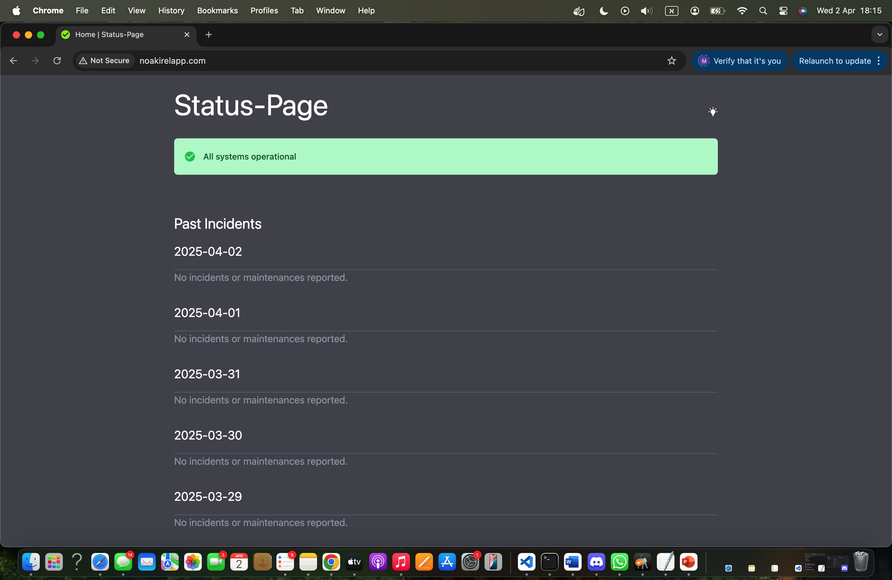
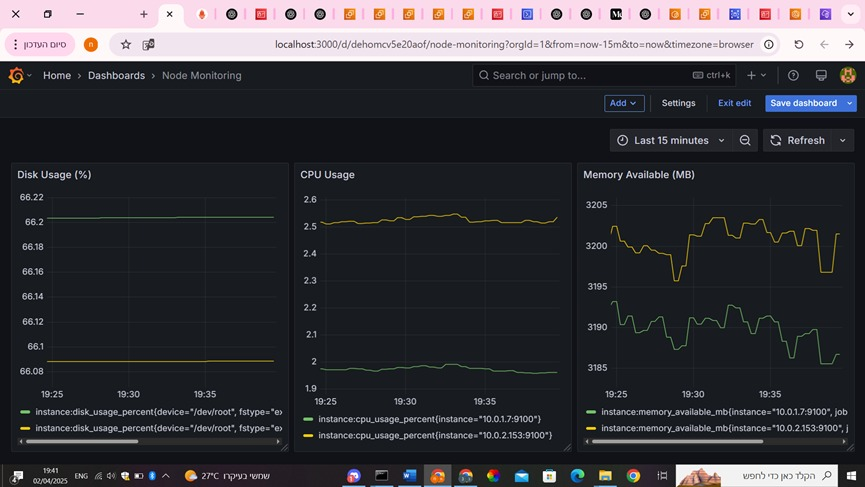

# 💅 Gossip Girl-Style Cloud Monitoring README

Hey Upper East Siders, 👑

Word on the (private) cloud is... someone's been building a chic and secure monitoring system to keep their AWS apps glowing like the Empire State at midnight. Want the scoop? Here’s everything you need to know to deploy your own fabulous observability stack.

XOXO,
Grafana Girl ”🖤

---

## 💭 The Dream
- A fully automated, secure monitoring setup on AWS.
- Real-time alerts faster than a Gossip Girl blast.
- Access via custom domains like `grafana.noakirelapp.com` (because elegance matters).
- Clean separation of public/private subnets, obviously.

---

## 💄 The Tech Glam Squad
| Role             | Tool                          | Why Darling?                                                |
|------------------|-------------------------------|--------------------------------------------------------------|
| The Star         | Grafana + Prometheus          | Powerful, beautiful, and oh-so-open-source 💅              |
| The Rich Parent  | AWS                           | Reliable, scalable, and totally A-list 🌐                    |
| The Secret Agent | Route 53 + ACM                | Handles DNS & SSL like it owns the Upper East Side 🔐        |
| The Organizer    | Docker Compose                | Because we need control, even in chaos 💼                    |
| The Future BFF   | GitHub Actions                | CI/CD for those who plan ahead (like Blair Waldorf) 🖖️       |

---

## 💋 How to Launch Your Own Monitoring Empire

### 💅 Step 1: Prep Your EC2
- Ubuntu instance
- Open ports: 80, 443, 3000 (via SG)
- Add to ALB Target Group (the exclusive guest list)

### 👯 Step 2: Clone the Repository
```bash
git clone https://github.com/YOUR_USERNAME/Status_page_FORKED_REPO.git
cd Status_page_FORKED_REPO/monitoring
```

### 🎀 Step 3: Use This Magical Script (`user-data.sh`)
```bash
#!/bin/bash
apt update && apt install -y docker.io git
systemctl enable --now docker
curl -L "https://github.com/docker/compose/releases/latest/download/docker-compose-$(uname -s)-$(uname -m)" -o /usr/local/bin/docker-compose
chmod +x /usr/local/bin/docker-compose
rm -rf /opt/monitoring
git clone --branch monitoring https://github.com/meitavEini/Status_page_FORKED_REPO.git /opt/monitoring
cd /opt/monitoring
docker-compose up -d
```

### 💅 File Layout (Because aesthetics matter)
```
monitoring/
├── docker-compose.yml
├── dashboards/
├── datasources.yml
├── dashboards.yml
└── .env
```

---

## 📸 Sneak Peek



---

## 🖥️ My Presentation - On GAMMA site 🖥️

https://status-page--izd68t7.gamma.site/

---

## 🌟 Once It's Live
- Head to https://grafana.noakirelapp.com
- Default login: `admin` / `admin` (change it darling!)
- Dashboards load automatically like your fave gossip blog

---

## 🚨 Problems? Never Heard of Her
| Drama                                | Fix                                                            |
|--------------------------------------|-----------------------------------------------------------------|
| SSL errors                           | Double-check your ACM cert + DNS records                       |
| Prometheus won’t start               | Check `prometheus.yml` path, sweetie 💅                         |
| DNS not resolving                    | Wait for Route 53 to gossip to the internet 🌐                 |

---

## 💎 What’s Next on the Timeline?
- Add spicy Grafana Alerts
- Make your dashboards sparkle
- Migrate to full Terraform (or Ansible for that extra glam)
- Monitor more services — because more is more ✨

---

## 🥂 Final Words
You just deployed your own stylish, secure, and scalable monitoring system in the cloud.
You're basically the Gossip Girl of observability now.

Stay fabulous 💋

— Yours truly,
Grafana Girl

